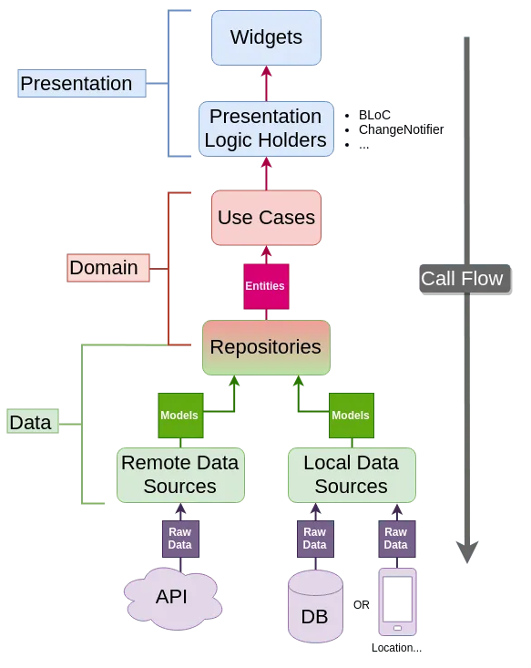

## Documentation

This project has been building using Flutter.

### Flutter 

[Flutter][flutter.dev] is Google’s UI toolkit for building beautiful, natively compiled applications for mobile, web, and desktop from a single codebase. 
 
To install it, follow the set-up steps in the [documentation][flutter.dev/install] guide according to your operating system. 

[flutter.dev]: https://flutter.dev/ 

[flutter.dev/install]: https://flutter.dev/docs/get-started/install 

### Set Up

#### Using Git

To run this project using Git, from the terminal:

1. Clone the existing repository.
2. Open the project in your favorite IDE.
3. Run `flutter pub get` in the root of the project. 
4. To run the project from terminal use:

```
flutter run 
```
or 

```
flutter run -d chrome
```

### Architecture 

The architecture in the application will be based on the implementation of Clear Architecture supported by the principles of Domain-Driven Design. 

* [Clean Architecture][ca] is a software design philosophy that separates the elements of a design into ring levels. The main rule of clean architecture is that code dependencies can only come from the outer levels inward. Code on the inner layers can have no knowledge of functions on the outer layers.


[ca]: https://blog.cleancoder.com/uncle-bob/2012/08/13/the-clean-architecture.html

* [Domain-Driven Design (DDD)][ddd] is an approach to software development that centers the development on programming a domain model that has a rich understanding of the processes and rules of a domain. The name comes from a 2003 book by Eric Evans that describes the approach through a catalog of patterns. Since then a community of practitioners have further developed the ideas, spawning various other books and training courses. The approach is particularly suited to complex domains, where a lot of often-messy logic needs to be organized. 



[ddd]: http://www.methodsandtools.com/archive/archive.php?id=97

### Project Structure

This project has a folder structure that depends on the architecture we are implementing. Each feature is present and is managed separately in each layer.

    ├─ lib
        ├─ Application
            ├─ tasks
                ├─ task_state
        ├─ Domain
            ├─ tasks
                ├─ models
                    ├─ task
                    ├─ group
                    ├─ ...
                ├─ use_cases
                    ├─ getTasks
              
                ├─ interfaces
            ├─ Core
        ├─ Infrastructure 
            ├─ Tasks  
                ├─ models
                    ├─ task
                ├─ repositories
                ├─ services
            ├─ Core
        ├─ Presentation
            ├─ Tasks
                ├─ home_page
                ├─ widgets
                ├─ ...
            ├─ Core
                ├─ responsivity

To add a new feature, just add a new folder with the name of it in each layer.

## Develop

### State Management (Provider + Service Locator)

* For State Management, this project is using [Provider][provider], the google recommended way to develop Flutter apps. Provider is a wrapper around InheritedWidget to make them easier to use and more reusable. We strongly recommend to read the [oficial documentation][provider], the [oficial example][example] and [this guide][guide] to evacuate all doubts before contributing to this project. 

* [GetIt][get_it] Simple direct Service Locator that allows to decouple the interface from a concrete implementation and to access the concrete implementation from everywhere in the app.

[get_it]: https://pub.dev/packages/get_it
[provider]: https://pub.dev/packages/provider
[guide]: https://medium.com/flutter-community/making-sense-all-of-those-flutter-providers-e842e18f45dd
[example]: https://flutter.dev/docs/development/data-and-backend/state-mgmt/simple

### Build Runner 

* [Build Runner][build_runner] is a package that provides a concrete way of generating files using Dart code, outside of tools like pub.
In the project, there are some clases that needs to be auto generated, like the `Routes` and `Injectable Class`.

To keep this files updated,run the next command from the terminal:

```
flutter pub run build_runner watch --delete-conflicting-outputs
```

[build_runner]: https://pub.dev/packages/build_runner

### Native Splash Screen

This project uses the [flutter_native_splash][splash] plugin to generate the native splash for android and ios. The splash screen is just a color here, and the animated logo y a dart screen. To regenerate the splash, change the options in the pubspec file and run:

```
flutter clean
flutter pub run flutter_native_splash:create
flutter run...
```

[splash]: https://pub.dev/packages/flutter_native_splash

## Working with responsive screens and different devices

All screens must be scalable due the different sizes of screens and big amount of device types.

To make a responsive view, we are going to follow [this approach](https://medium.com/flutter-community/flutter-effectively-scale-ui-according-to-different-screen-sizes-2cb7c115ea0a).

To simplify the development and centralize the process, we develop a set of widgets that shares all the information needed to make a responsive screen. These widget are the following:

- ResponsiveWidget (located in presentation/core/widgets/device_detector.dart) is the widget that generate all information related to the device and shares it with its childs.

- DeviceDetector (located in the same file than Responsive Widget) will identify the type of your device (phone/tablet) and allow us to provide different views for each one. DeviceDetector uses a ResposiveWidget and shares the same information to its childs.

- OrientationLayout (located in the same file than Responsive Widget) will identify the orientation of the device and allow us to provide different views for each orientation. You can combine this widget with the DeviceDetector to provide all posible combinations of screen sizes and orientation

On the other hand, using these widgets, we create the most common responsive widgets:

-ResponsiveText: Is like the Text widget, but it will change its text size according to the screen size. You can find this widget in presentation/core/widgets/responsive_text.

- ResponsiveInput: Is like the TextFormField widget, but it will change its text size according to the screen size. You can find this widget in presentation/core/widgets/responsive_text.

In both cases, you need to provide the TextType param to choose the textStyle. TextStyle calculation is made in the same file, you can change it, but be aware all the App is goint to be using it.


#### ANDROID

- Go to project configuration on the firebase console and add a new android app. You can find the package name in the android manifest. This project is set with 'com.atv.gruas'
- Go to the firebase console and generate the google-services.json with the app name. 
- Download and replace the google-services.json file in android/app/

## Deployment

#### Release version for Android

To generate the release version for Android:

1. Update the version in the `pubspec.yaml` file:
2. Run the next command from the terminal.

```
flutter build apk --release --dart-define=ENV=dev --dart-define=APP_SUFFIX=dev 
```

3. Upload the generated file to AppCenter.

For more info or possible issues in release versions, please check the [Documentation for Android Deployment][deploymentAndroid].

[deploymentAndroid]: https://flutter.dev/docs/deployment/android

#### Release version for iOS

To generate the release version for iOS:

1. Update the version in the `pubspec.yaml` file:
2. Run the next command from the terminal, to create the release build.

```
flutter build ios --release --dart-define=ENV=dev --dart-define=APP_SUFFIX=dev
```

3. Then you need to create a build archive, for that follow the documentation in the [Create a build archive][deploymentIos] section.

For more info or possible issues in release versions, please check the [Documentation for iOS Deployment][deploymentIos].

[deploymentIos]: https://flutter.dev/docs/deployment/ios


## Coverage Reports

To generate the code coverage report you need to install lcov:

Installing in Ubuntu:

```
sudo apt-get update -qq -y
sudo apt-get install lcov -y
```

Installing in Mac:

```
brew install lcov
```
Then, generate the lcov file by running all tests with the following command:

```
flutter test --coverage
```
The coverage info will be created on ```/coverage/lcov.info```.

For generate the html Code Coverage Report (only Mac and Ubuntu) run:

```
genhtml coverage/lcov.info -o coverage/html
```

Then, look for the index.html file and open with your favorite web-browser
